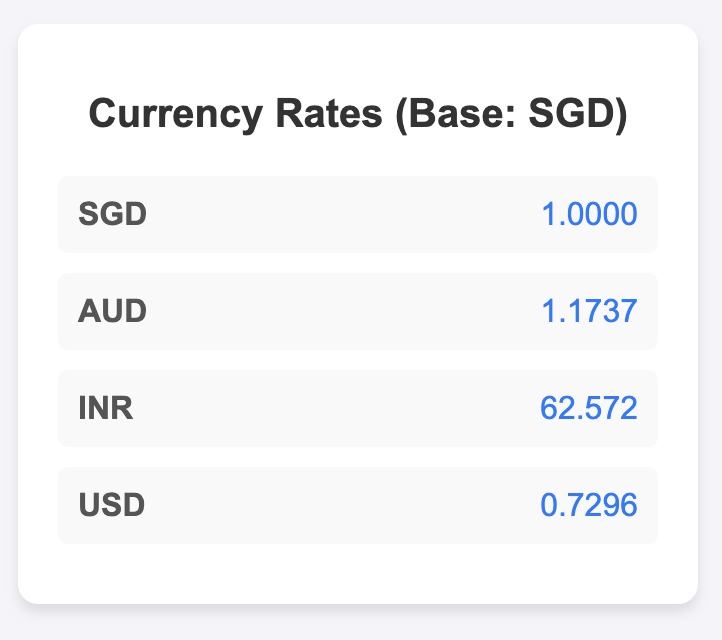

### Quick project for personal purposes

A Progressive Web App (PWA) that displays real-time currency exchange rates. 
Built with Vite, this app works seamlessly on both mobile and desktop devices.

### Features 
- Installable on mobile devices and works offline using a service worker.
- Fetches and displays the latest exchange rates for AUD, INR, and USD based on SGD.
- Responsive Design for both mobile and desktop screens.

### Tools and Acknowledgements

API used - ExchangeRate-API available at https://app.exchangerate-api.com

[Favicon by Freepik - Flaticon](https://www.flaticon.com/free-icons/exchange-rate)

Favicon tool used - https://realfavicongenerator.net/